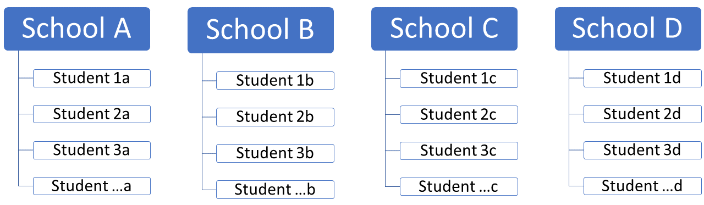
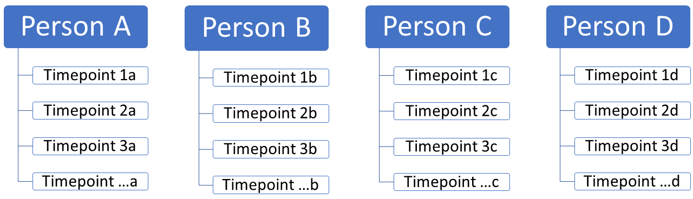
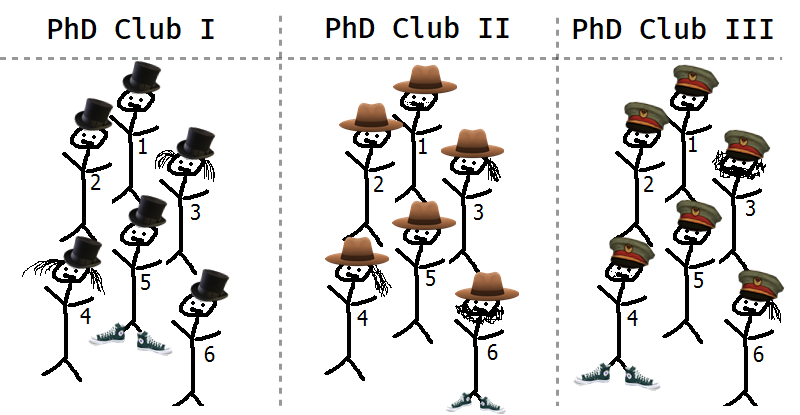

layout: true
    
<style>
.onehundredtwenty {
  font-size: 120%;
   }

<style>
.ninety {
  font-size: 90%;
   }

.eightyfive {
  font-size: 85%;
   }
   
.eighty {
  font-size: 80%;
   }
   
.seventyfive {
  font-size: 75%;
   }
   
.seventy {
  font-size: 70%;
   }
   
.fifty {
  font-size: 50%;
   }
   
.forty {
  font-size: 40%;
   }
   
.pull-left80 {
  float: left;
  width: 80%;
}
.pull-right20 {
  float: right;
  width: 20%;
}
</style>
    
<div class="logo"></div> 


```{r setup, include=FALSE}
# Here you can place global options for the entire document.
# Mostly used for knitr settings, but can also load data etc.
# Whatever happens here will not show in the presentation.
knitr::opts_chunk$set(fig.retina = 3, 
                      warning = FALSE, 
                      message = FALSE,
                      echo = TRUE)

pacman::p_load(tidyverse, bayestestR, lme4, bmisc)

set.seed(101)  # for reproducibility
example_data <- palmerpenguins::penguins %>% 
  select(Group = species, x = bill_length_mm, y = flipper_length_mm)  %>% 
  mutate(x = (80 - x) / 5,
         y = (300 - y) / 15) %>%
  bind_rows(palmerpenguins::penguins %>% 
              mutate(Group = paste0(species, "B")) %>% 
  select(Group, x = bill_length_mm, y = flipper_length_mm)  %>% 
  mutate(x = (85 - x) / 5,
         y = (305 - y) / 15)) %>% 
  group_by(Group) %>% 
  mutate(y_rev = rev(y)) %>% 
  ungroup(Group) %>% 
  # arrange(desc(y)) %>% 
  mutate(y = ifelse(Group == "Gentoo", y + 2, y)) %>% 
  mutate(y = ifelse(Group == "GentooB", y - 2.5, y)) %>% 
  mutate(y = ifelse(Group == "AdelieB", y + 2, y)) %>% 
  mutate(y = ifelse(Group == "Adelie", y - 1, y)) %>% 
  mutate(y = ifelse(Group == "Chinstrap", y + 2, y)) %>%
  mutate(y = ifelse(Group == "ChinstrapB", y - 2, y)) %>%
  group_by(Group) %>% 
  mutate(y = ifelse(Group %in% c("ChinstrapB", "AdelieB", "Gentoo"), rev(y), y)) %>% 
  ungroup(Group) %>% 
  mutate(x = ifelse(Group %in% c("GentooB"), x-2, x)) %>% 
  mutate(x = ifelse(Group %in% c("Gentoo"), x+2, x))


# example_data <- sim_ris(m = 5, n = 50, mu = c(1, 5), sigma = c(5, 4, 10)) %>% 
#   mutate(Group = as.character(subject))


example_data2 <- simulate_simpson(n = 100, groups = 10, r = -0.5) %>% 
  rename(x = V1, y = V2)


ess <- readRDS("data/ess_inc.rds") %>% 
  drop_na(income, cntry, education)

```

```{r xaringanExtra, echo = FALSE}
xaringanExtra::use_progress_bar(color = "#0051BA", location = "bottom")
xaringanExtra::use_panelset()

xaringanExtra::style_panelset_tabs(
  tabs_sideways_max_width = "28%"
  # active_foreground = "#0051BA",
  # hover_foreground = "#d22"#,
  # inactive_opacity = 0,
  # font_family = "Roboto"
)


geom_slope_triangle <- function(fort, lower_boundary = 0.3, upper_boundary = 0.6, inv = F, seed, ...) {
  
  # fort <- fortified2
  
  set.seed(seed)
  
  lb <- quantile(fort$.fitted, probs = lower_boundary)
  ub <- quantile(fort$.fitted, probs = upper_boundary)
  
  www <- bind_rows(
    fortified2 %>% filter(.fitted < lb) %>% sample_n(1),
    fortified2 %>% filter(.fitted > ub) %>% sample_n(1)
  )
  
  inters <- retistruct::line.line.intersection(
    ## Line 1
    c(www$x[1], www$.fitted[1]),     ## on the regression line
    c(www$x[1], www$.fitted[1] - 10), ## bit further to the right
    ## Line 2
    c(www$x[2], www$.fitted[2]),     ## on the regression line
    c(www$x[2] + 10, www$.fitted[2])    ## bit further down
  )
  
  # geom_segment(inherit.aes=FALSE,
  #              x = www$x[2],     ## regression starting point
  #              xend = inters[1],       ## to intersection
  #              y = www$.fitted[1],     ## on the height of regression line
  #              yend=www$.fitted[1]
  #              ) +
  # geom_segment(inherit.aes=FALSE,
  #              x = www$x[2],     ## on the x of regression line
  #              xend=www$x[2],    ## on the x of regression line
  #              y = www$.fitted[1],     ## regression starting point
  #              yend=inters[2]         ## to intersection
  #              ) 
  
  if(inv){
    ho <- 2
    ve <- 1
  } else {
    ho <- 1
    ve <- 2
  }
  
  list(
  geom_segment(inherit.aes=FALSE,
               x = www$x[2],     ## regression starting point
               xend = inters[1],       ## to intersection
               y = www$.fitted[ho],     ## on the height of regression line
               yend=www$.fitted[ho],     ## on the height of regression line
               ...
               ) ,
  geom_segment(inherit.aes=FALSE,
               x = www$x[ve],     ## on the x of regression line
               xend=www$x[ve],    ## on the x of regression line
               y = www$.fitted[1],     ## regression starting point
               yend=inters[2],          ## to intersection
               ...
               ) 
  )
  
  
}

```

---


class: white

#### Everyone struggles at first but it gets better!

```{r, echo = F, out.width="90%", fig.align = 'center'}
knitr::include_graphics("https://raw.githubusercontent.com/favstats/ds3_r_intro/main/images/r_first_then_new.png")
```


<!-- {width=50%} -->

.fifty[Illustration adapted from [Allison Horst](https://twitter.com/allison_horst)]

--

  + My experience is that this stuff isn't super easy... but it gets better!
  
--
  
+ Awesome inclusive community that is always ready to help
+ Active blogosphere with use cases and examples


---

### Overview

+ **Why** *Multilevel Models*?
+ **What** are *Multilevel Models*?
+ **How** estimate *Multilevel Models*?
+ **How** interpret *Multilevel Models*?
+ **How** diagnose *Multilevel Models*?

---


class: white

### Data Structures


.eightyfive[You might be used to your data looking like this: An independent variable $x$ and a dependent variable $y$.]

.leftcol80[
```{r, echo=F, fig.width=10, fig.height=5.5}
example_data2  %>% 
  ggplot(aes(x = x, y = y))  +
  geom_point() +
  geom_smooth(method = "lm", se = F) +
  ggpubr::stat_cor(label.x = 10, label.y.npc = "bottom") +
  theme_minimal()
```

]

--

.rightcol20[

<br>
<br>
<br>

.eightyfive[From this data we may conclude that *x is **positively** correlated with y*.]

]


---


class: white

### Data Structures


.eightyfive[However, if we introduce *groupings* of the data, a different picture emerges.]

.pull-left80[
```{r, echo=F, fig.width=10, fig.height=5.5}
example_data2  %>% 
  ggplot(aes(x = x, y = y))  +
  geom_point(aes(color = Group)) +
  geom_smooth(aes(color = Group), method = "lm", se = F) +
  geom_smooth(method = "lm", se = F, color = "black") +
  ggpubr::stat_cor(aes(color = Group), label.x = 10, label.y.npc = "bottom") +
  theme_minimal() +
  theme(legend.position = "none")
```

]

--

.pull-left20[

<br>
<br>
<br>

.eightyfive[In each of the groupings we find a ***negative** correlation between x and y*.]

]

---

class: black

### So what is going on?

--

.pull-left[

A phenomena called:

# .green[.onehundredtwenty[.creepy[Simpson's Paradox]]]


]

--

.pull-right[


.eighty[+ Has nothing to do with the Simpsons]

.eighty[+ Is not all that scary]


.eighty["**Simpson’s Paradox** is a statistical phenomenon where an association between two variables in a population ***emerges***, ***disappears*** or ***reverses*** when the population is divided into subpopulations."]

.fifty[(Stanford Encyclopedia of Philosophy 2021)]

```{r, fig.height=2, fig.width=6, echo = F}
example_data2  %>% 
  ggplot(aes(x = x, y = y))  +
  geom_point(aes(color = Group), size = 0.5) +
  geom_smooth(aes(color = Group), method = "lm", se = F) +
  geom_smooth(method = "lm", se = F, color = "white") +
  theme_void() +
  theme(legend.position = "none",
   panel.grid.minor = element_blank(), 
   panel.grid.major = element_blank(),
   plot.background = element_rect(fill = "black", colour = NA)
    ) # all rectangles)
```

]


---

class: white

### Data Structures

Simpson's paradox teaches us that we have to be mindful of *structures* within our data.


.pull-left[

We might have students **nested** in schools



.eighty[Students on the *first level*, schools on the *second level*]
]

--

.pull-right[

Or timepoints **nested** in people



.eighty[Timepoints on the *first level*, people on the *second level*]
]

--

We can also easily imagine a **three-level data structure**: 

> timepoints nested in people nested in schools

---

class: white

### Data Structures

.eighty[There are two types of variance important to consider in our modeling:]

+ .eighty[**within-group variance** (i.e. differences *within a group*)]

+ .eighty[**between-group variance** (i.e. differences *between groups*)]

.leftcol65[



]

.rightcol35[
<br><br><br>

> Data points within a group are often more similar than between groups.


<br><br><br>

.fifty[Elaborate sketch of a multilevel data structure]
]


<!--  -->


---

### Why Multilevel Models?

--

+ Control for multilevel structures: your data may have
  + different average levels of your dependent and independent variables
  + how does your effect of interest vary by group?
  
+ More accurate calculation of standard errors
  + Standard linear regression assumes independence of cases and errors

+ Estimate group-level predictors and cross-level interactions
  + for example, how is the GDP of a country associated with individual-level variables


---

### What is a Multilevel Model

+ Maximum Likelihood

+ Estimate a model per group

+ Fixed and random effects

+ Random intercepts and random slopes


---

### What is a model?

A simplified but informative representation of a phenomena.

This is a simple linear regressions:

$$y = \color{blue}{\alpha} +  \color{lightgreen}{\beta} \times X + \color{purple}{\epsilon_i} $$

This is a Null Model:

$$y = \color{blue}{\alpha} + \color{purple}{\epsilon_i}$$


---

class: white

### Linear Regression I

.leftcol20[

<br>
<br>
<br>

.eightyfive[Imagine we have a dependent variable $y$. It is distributed like this:]


]

.rightcol80[


```{r, echo=F, fig.width=10, fig.height=5.5}
smaller_data <- example_data %>% 
  group_by(Group) %>%
  sample_n(50)
  
y_mean <- mean(smaller_data$y, na.rm = T)

fit <- lm(y ~ 1, data = smaller_data)

# New! (not available in ggplot2 version 2.2.1 or earlier)
pos <- position_jitter(width = 0.15, height = 0, seed = 2)

fortify(fit) %>% 
  mutate(id = 1:n() %>% as.character()) %>% 
  mutate(highlight = ifelse(sample(.$id, 2) == id, "no", "yes")) %>% 
  ggplot(aes(x="Example", y=y, label=round(.resid, 2))) +
  geom_jitter(position = pos) +
  geom_line(aes(x = "Example", y=.fitted), inherit.aes=FALSE) +
  # geom_hline(yintercept = y_mean) +
  # geom_segment(aes(xend="Example", yend=.fitted, x = "Example"), position = pos) +
  # ggrepel::geom_text_repel(aes(vjust=-1*sign(.resid)),
  #   position = pos) +
  theme_minimal() +
  theme(legend.position="none",
        axis.title.x=element_blank(),
        axis.text.x=element_blank(),
        axis.ticks.x=element_blank()) +
  scale_alpha_discrete(range = c(0.5, 1)) +
  # scale_colour_grey() +
  scale_x_discrete(breaks = NULL) +
  ggthemes::scale_color_gdocs()
```

]


---

class: white

### Linear Regression II - Null Model


.leftcol20[

<br>
<br>
<br>

**$$y = \color{blue}{\alpha} + \color{purple}{\epsilon_i}$$**


]


.rightcol80[


```{r, echo=F, fig.width=10, fig.height=5.5}
fortify(fit) %>% 
  mutate(id = 1:n() %>% as.character()) %>% 
  mutate(highlight = ifelse(sample(.$id, 2) == id, "no", "yes")) %>% 
  ggplot(aes(x="Example", y=y, label=round(.resid, 2))) +
  geom_jitter(position = pos) +
  geom_line(aes(x = "Example", y=.fitted), inherit.aes=FALSE) +
  geom_hline(yintercept = y_mean, color = "blue") +
  annotate("text", y = y_mean + 0.15, x = 1.3, label = y_mean) +
  # geom_segment(aes(xend="Example", yend=.fitted, x = "Example"), position = pos) +
  # ggrepel::geom_text_repel(aes(vjust=-1*sign(.resid)),
  #   position = pos) +
  theme_minimal() +
  theme(legend.position="none",
        axis.title.x=element_blank(),
        axis.text.x=element_blank(),
        axis.ticks.x=element_blank()) +
  scale_alpha_discrete(range = c(0.5, 1)) +
  # scale_colour_grey() +
  scale_x_discrete(breaks = NULL) +
  ggthemes::scale_color_gdocs()
```

]


---

class: white

### Linear Regression III - Null Model

.leftcol20[

<br>
<br>
<br>

**$$y = \color{blue}{\alpha} + \color{purple}{\epsilon_i}$$**


]


.rightcol80[


```{r, echo=F, fig.width=10, fig.height=5.5}
fortify(fit) %>% 
  mutate(id = 1:n() %>% as.character()) %>% 
  mutate(highlight = ifelse(sample(.$id, 2) == id, "no", "yes")) %>% 
  ggplot(aes(x="Example", y=y, label=round(.resid, 2))) +
  geom_jitter(position = pos) +
  geom_line(aes(x = "Example", y=.fitted), inherit.aes=FALSE) +
  geom_hline(yintercept = y_mean, color = "blue") +
  geom_segment(aes(xend="Example", yend=.fitted, x = "Example"), position = pos, color = "purple") +
  annotate("text", y = y_mean + 0.15, x = 1.3, label = y_mean) +
  theme_minimal() +
  theme(legend.position="none",
        axis.title.x=element_blank(),
        axis.text.x=element_blank(),
        axis.ticks.x=element_blank()) +
  scale_alpha_discrete(range = c(0.5, 1)) +
  # scale_colour_grey() +
  scale_x_discrete(breaks = NULL) +
  ggthemes::scale_color_gdocs()
```

]


---

class: white

### Linear Regression IV - Slope


.leftcol20[

<br>
<br>
<br>

**$$y = \color{blue}{\alpha} +  \color{lightgreen}{\beta} \times X + \color{purple}{\epsilon_i}$$**


]


.rightcol80[


```{r, echo=F, fig.width=10, fig.height=5.5}
fit2 <- lm(y ~ x, data = smaller_data)


fortified2 <- fortify(fit2) 

fortified2 %>% 
  ggplot(aes(x=x, y=y, xend=x, yend=y, label=round(.resid, 2))) +
  geom_point() +
  geom_line(aes(x=x, y=.fitted), inherit.aes=FALSE) +
  geom_segment(aes(y=.fitted), color = "purple") +
  # geom_text(aes(vjust=-1*sign(.resid))) +
  theme_minimal() +
  theme(legend.position="none")  +
  ggthemes::scale_color_gdocs()

```

]


---

class: white

### Linear Regression V - Slope


.leftcol20[

<br>
<br>
<br>

**$$y = \color{blue}{\alpha} +  \color{lightgreen}{\beta} \times X + \color{purple}{\epsilon_i}$$**


]


.rightcol80[


```{r, echo=F, fig.width=10, fig.height=5.5}
fortified2 %>% 
  ggplot(aes(x=x, y=y, xend=x, yend=y, label=round(.resid, 2))) +
  geom_point() +
  geom_segment(aes(y=.fitted), color = "purple") +
  geom_line(aes(x=x, y=.fitted), inherit.aes=FALSE, color = "blue") +
  # geom_point(data = www, aes(x=x, y=.fitted), color = "red", size = 5) +
  geom_slope_triangle(fort = fortified2, color = "lightgreen", linetype = "dashed", seed = 20, size = 1.5) +
  # geom_text(aes(vjust=-1*sign(.resid))) +
  
  theme_minimal() +
  theme(legend.position="none")  +
  ggthemes::scale_color_gdocs()
```

]

---

class: black, middle, center

## .onehundredtwenty[.green[.matrix[Enter the M U L T I L E V E L]]]


---

class: white


### Multilevel Data I 


.leftcol30[

<br>
<br>
<br>

Now, we have the same dataset as before.


]


.rightcol70[


```{r, echo=F, fig.width=10, fig.height=5.5}
null_model <- lmer(y ~ (1|Group), data = smaller_data)

sum_null <- summary(null_model)

fix_null <- broom.mixed::tidy(null_model) %>% 
  filter(effect == "fixed")

random_intercepts <- coef(null_model)$Group %>% 
  janitor::clean_names() %>% 
  rownames_to_column("Group")

broom.mixed::augment(null_model) %>% 
  left_join(random_intercepts) %>% 
  mutate(id = 1:n() %>% as.character()) %>% 
  mutate(highlight = ifelse(sample(.$id, 2) == id, "no", "yes")) %>% 
  ggplot(aes(x="Example", y=y, label=round(.resid, 2))) +
  geom_jitter(position = pos) +
  # geom_line(aes(x = "Example", y=.fitted), inherit.aes=FALSE) +
  # geom_hline(yintercept = fix_null$estimate, color = "blue", size = 1.5) +
  # annotate("text", y = fix_null$estimate + 0.15, x = 1.3, label = fix_null$estimate) +
  # geom_hline(aes(yintercept = intercept, color = Group)) +
  # geom_segment(aes(xend="Example", yend=.fitted, x = "Example"), position = pos) +
  # ggrepel::geom_text_repel(aes(vjust=-1*sign(.resid)),
  #   position = pos) +
  theme_minimal() +
  theme(legend.position="none",
        axis.title.x=element_blank(),
        axis.text.x=element_blank(),
        axis.ticks.x=element_blank()) +
  scale_alpha_discrete(range = c(0.5, 1)) +
  # scale_colour_grey() +
  scale_x_discrete(breaks = NULL) +
  ylim(2, 10) +
  ggthemes::scale_color_gdocs()
```

]


---

class: white

### Multilevel Data II


.leftcol30[

<br>
<br>
<br>

Now, we have the same dataset as before. 

But this time we introduce a multilevel data structure, i.e. our data points are **nested** in *six other groups*.


]


.rightcol70[


```{r, echo=F, fig.width=10, fig.height=5.5}
broom.mixed::augment(null_model) %>% 
  left_join(random_intercepts) %>% 
  mutate(id = 1:n() %>% as.character()) %>% 
  mutate(highlight = ifelse(sample(.$id, 2) == id, "no", "yes")) %>% 
  ggplot(aes(x="Example", y=y, label=round(.resid, 2), color = Group)) +
  geom_jitter(position = pos) +
  # geom_line(aes(x = "Example", y=.fitted), inherit.aes=FALSE) +
  # geom_hline(yintercept = fix_null$estimate, color = "blue", size = 1.5) +
  # annotate("text", y = fix_null$estimate + 0.15, x = 1.3, label = fix_null$estimate) +
  # geom_hline(aes(yintercept = intercept, color = Group)) +
  # geom_segment(aes(xend="Example", yend=.fitted, x = "Example"), position = pos) +
  # ggrepel::geom_text_repel(aes(vjust=-1*sign(.resid)),
  #   position = pos) +
  theme_minimal() +
  theme(legend.position="none",
        axis.title.x=element_blank(),
        axis.text.x=element_blank(),
        axis.ticks.x=element_blank()) +
  scale_alpha_discrete(range = c(0.5, 1)) +
  # scale_colour_grey() +
  scale_x_discrete(breaks = NULL) +
  ylim(2, 10) +
  ggthemes::scale_color_gdocs()

```

]


---


class: white

### Multilevel - Random Intercepts I - Null Model


.leftcol30[


First, we estimate a **null model** again. 

In a multilevel context this means estimating a **random intercept** only model, without any predictors. 

Notice how each group gets their own intercept. 

The intercept in thick blue is called the *grand mean* and shows the average intercept across all groups.


]


.rightcol70[


```{r, echo=F, fig.width=10, fig.height=5.5}
broom.mixed::augment(null_model) %>% 
  left_join(random_intercepts) %>% 
  mutate(id = 1:n() %>% as.character()) %>% 
  mutate(highlight = ifelse(sample(.$id, 2) == id, "no", "yes")) %>% 
  ggplot(aes(x="Example", y=y, label=round(.resid, 2), color = Group)) +
  geom_jitter(position = pos) +
  # geom_line(aes(x = "Example", y=.fitted), inherit.aes=FALSE) +
  geom_hline(yintercept = fix_null$estimate, color = "blue", size = 1.5) +
  annotate("text", y = fix_null$estimate + 0.15, x = 1.3, label = fix_null$estimate) +
  geom_hline(aes(yintercept = intercept, color = Group)) +
  # geom_segment(aes(xend="Example", yend=.fitted, x = "Example"), position = pos) +
  # ggrepel::geom_text_repel(aes(vjust=-1*sign(.resid)),
  #   position = pos) +
  theme_minimal() +
  theme(legend.position="none",
        axis.title.x=element_blank(),
        axis.text.x=element_blank(),
        axis.ticks.x=element_blank()) +
  scale_alpha_discrete(range = c(0.5, 1)) +
  # scale_colour_grey() +
  scale_x_discrete(breaks = NULL) +
  ylim(2, 10) +
  ggthemes::scale_color_gdocs()

```

]


---

class: white

### Multilevel - Random Intercepts II - Null Model


.leftcol30[

<br>
<br>
<br>

The null model introduces an error term relating to each intercept.

This shows the **within-group** variation.


]


.rightcol70[


```{r, echo=F, fig.width=10, fig.height=5.5}
broom.mixed::augment(null_model) %>% 
  left_join(random_intercepts) %>% 
  mutate(id = 1:n() %>% as.character()) %>% 
  mutate(highlight = ifelse(sample(.$id, 2) == id, "no", "yes")) %>% 
  ggplot(aes(x="Example", y=y, label=round(.resid, 2), color = Group)) +
  geom_jitter(position = pos) +
  # geom_line(aes(x = "Example", y=.fitted), inherit.aes=FALSE) +
  geom_hline(yintercept = fix_null$estimate, color = "blue", size = 1.5) +
  annotate("text", y = fix_null$estimate + 0.15, x = 1.3, label = fix_null$estimate) +
  geom_hline(aes(yintercept = intercept, color = Group)) +
  geom_segment(aes(xend="Example", yend=.fitted, x = "Example"), position = pos) +
  # ggrepel::geom_text_repel(aes(vjust=-1*sign(.resid)),
  #   position = pos) +
  theme_minimal() +
  theme(legend.position="none",
        axis.title.x=element_blank(),
        axis.text.x=element_blank(),
        axis.ticks.x=element_blank()) +
  scale_alpha_discrete(range = c(0.5, 1)) +
  # scale_colour_grey() +
  scale_x_discrete(breaks = NULL) +
  ylim(2, 10) +
  ggthemes::scale_color_gdocs()

```

]


---

class: white

### Multilevel - Random Intercepts III - Null Model


.leftcol30[

<br>
<br>
<br>

We've also introduced an error term for each group intercept, i.e. differences between the grand mean and other group-specific intercepts.

This shows the **between-group** variation.


]


.rightcol70[


```{r, echo=F, fig.width=10, fig.height=5.5}
augmented_intercepts <- broom.mixed::augment(null_model) %>% 
  left_join(random_intercepts)

augmented_intercepts %>% 
  mutate(id = 1:n() %>% as.character()) %>% 
  mutate(highlight = ifelse(sample(.$id, 2) == id, "no", "yes")) %>% 
  ggplot(aes(x="Example", y=y, label=round(.resid, 2), color = Group)) +
  geom_jitter(position = pos) +
  # geom_line(aes(x = "Example", y=.fitted), inherit.aes=FALSE) +
  geom_hline(yintercept = fix_null$estimate, color = "blue", size = 1.5) +
  annotate("text", y = fix_null$estimate + 0.15, x = 1.3, label = fix_null$estimate) +
  geom_hline(aes(yintercept = intercept, color = Group))  +
  geom_segment(data = augmented_intercepts %>% distinct(intercept, .keep_all = T), 
               aes(y =  fix_null$estimate, xend="Example", yend=intercept, x = "Example", color = Group), 
               position = position_jitter(height = 0, width = 0.25, seed = 3), inherit.aes = F,
               size = 1.2,
               arrow = arrow(length = unit(0.1, "inches"))) +
  # ggrepel::geom_text_repel(aes(vjust=-1*sign(.resid)),
  #   position = pos) +
  theme_minimal() +
  theme(legend.position="none",
        axis.title.x=element_blank(),
        axis.text.x=element_blank(),
        axis.ticks.x=element_blank()) +
  scale_alpha_discrete(range = c(0.5, 1)) +
  # scale_colour_grey() +
  scale_x_discrete(breaks = NULL) +
  ylim(2, 10) +
  ggthemes::scale_color_gdocs()

```

]

---

class: white, middle, center

### Multilevel - Random Intercepts - Fixed Slope

Varying starting point (intercept), same slope for each group.

---

class: white

### Multilevel - Random Intercepts - Fixed Slope I


.leftcol30[

<br>
<br>
<br>

We now introduce a dependent variable $x$ to our multilevel model but keep it fixed, i.e. it is the same across all groups.

The thick blue line shows the group-adjusted slope.


]


.rightcol70[


```{r, echo=F, fig.width=10, fig.height=5.5}
pred_model <- lmer(y ~ x + (1|Group), data = smaller_data)

sum_pred <- summary(pred_model)

fix_pred <- broom.mixed::tidy(pred_model) %>% 
  filter(effect == "fixed")

random_intercepts_pred <- coef(pred_model)$Group %>% 
  janitor::clean_names() %>% 
  rownames_to_column("Group") %>% 
  rename(slope = x)

broom.mixed::augment(pred_model) %>% 
  left_join(random_intercepts_pred) %>% 
  mutate(id = 1:n() %>% as.character()) %>% 
  mutate(highlight = ifelse(sample(.$id, 2) == id, "no", "yes")) %>% 
  ggplot(aes(x=x, y=y, label=round(.resid, 2))) +
  geom_point(aes(color = Group)) +
  # geom_smooth(method = "lm", se = F) +
  geom_line(aes(x = x, y=.fixed), inherit.aes=FALSE, color = "blue", size = 1.5) +
  # geom_line(aes(x = x, y=.fitted, color = Group), inherit.aes=FALSE) +
  # geom_hline(yintercept = fix_pred$estimate, color = "blue", size = 1.5) +
  # annotate("text", y = fix_pred$estimate + 0.15, x = 1.3, label = fix_pred$estimate) +
  # geom_hline(aes(yintercept = intercept, color = Group)) +
  # geom_segment(aes(xend=x, yend=.fitted, x = x, color = Group)) +
  # ggrepel::geom_text_repel(aes(vjust=-1*sign(.resid)),
    # position = pos) +
  theme_minimal() +
  theme(legend.position="none") +
  scale_alpha_discrete(range = c(0.5, 1)) +
  # scale_colour_grey() +
  scale_x_discrete(breaks = NULL) +
  ylim(2, 10) +
  ggthemes::scale_color_gdocs()


```

]


---

class: white

### Multilevel - Random Intercepts - Fixed Slope II


.leftcol30[

<br>
<br>
<br>

The slope is held constant across all of our groups.


]


.rightcol70[


```{r, echo=F, fig.width=10, fig.height=5.5}
pred_model <- lmer(y ~ x + (1|Group), data = smaller_data)

sum_pred <- summary(pred_model)

fix_pred <- broom.mixed::tidy(pred_model) %>% 
  filter(effect == "fixed")

random_intercepts_pred <- coef(pred_model)$Group %>% 
  janitor::clean_names() %>% 
  rownames_to_column("Group") %>% 
  rename(slope = x)

broom.mixed::augment(pred_model) %>% 
  left_join(random_intercepts_pred) %>% 
  mutate(id = 1:n() %>% as.character()) %>% 
  mutate(highlight = ifelse(sample(.$id, 2) == id, "no", "yes")) %>% 
  ggplot(aes(x=x, y=y, label=round(.resid, 2))) +
  geom_point(aes(color = Group)) +
  # geom_smooth(method = "lm", se = F) +
  geom_line(aes(x = x, y=.fixed), inherit.aes=FALSE, color = "blue", size = 1.5) +
  geom_line(aes(x = x, y=.fitted, color = Group), inherit.aes=FALSE) +
  # geom_hline(yintercept = fix_pred$estimate, color = "blue", size = 1.5) +
  # annotate("text", y = fix_pred$estimate + 0.15, x = 1.3, label = fix_pred$estimate) +
  # geom_hline(aes(yintercept = intercept, color = Group)) +
  # geom_segment(aes(xend=x, yend=.fitted, x = x, color = Group)) +
  # ggrepel::geom_text_repel(aes(vjust=-1*sign(.resid)),
    # position = pos) +
  theme_minimal() +
  theme(legend.position="none") +
  scale_alpha_discrete(range = c(0.5, 1)) +
  # scale_colour_grey() +
  scale_x_discrete(breaks = NULL) +
  ylim(2, 10) +
  ggthemes::scale_color_gdocs()


```

]


---


class: white

### Multilevel - Random Intercepts - Fixed Slope III


.leftcol30[

<br>
<br>
<br>

Again, in a multilevel model, error terms for individual data points are estimated by group.

This shows the **within-group** variation.

]


.rightcol70[


```{r, echo=F, fig.width=10, fig.height=5.5}

broom.mixed::augment(pred_model) %>% 
  left_join(random_intercepts_pred) %>% 
  mutate(id = 1:n() %>% as.character()) %>% 
  mutate(highlight = ifelse(sample(.$id, 2) == id, "no", "yes")) %>% 
  ggplot(aes(x=x, y=y, label=round(.resid, 2))) +
  geom_point(aes(color = Group)) +
  # geom_smooth(method = "lm", se = F) +
  geom_line(aes(x = x, y=.fixed), inherit.aes=FALSE, color = "blue", size = 1.5) +
  geom_line(aes(x = x, y=.fitted, color = Group), inherit.aes=FALSE) +
  # geom_hline(yintercept = fix_pred$estimate, color = "blue", size = 1.5) +
  # annotate("text", y = fix_pred$estimate + 0.15, x = 1.3, label = fix_pred$estimate) +
  # geom_hline(aes(yintercept = intercept, color = Group)) +
  geom_segment(aes(xend=x, yend=.fitted, x = x, color = Group)) +
  # ggrepel::geom_text_repel(aes(vjust=-1*sign(.resid)),
    # position = pos) +
  theme_minimal() +
  theme(legend.position="none") +
  scale_alpha_discrete(range = c(0.5, 1)) +
  # scale_colour_grey() +
  scale_x_discrete(breaks = NULL) +
  ylim(2, 10) +
  ggthemes::scale_color_gdocs()


```

]


---


class: white

### Multilevel - Random Intercepts - Fixed Slope IV

.leftcol30[

<br>
<br>
<br>

And similar as before, we have an error term for the random intercept.

This shows the **between-group** variation.

]


.rightcol70[


```{r, echo=F, fig.width=10, fig.height=5.5}

augmented_slopes <- broom.mixed::augment(pred_model) %>% 
  left_join(random_intercepts_pred) 

augmented_slopes %>% 
  mutate(id = 1:n() %>% as.character()) %>% 
  mutate(highlight = ifelse(sample(.$id, 2) == id, "no", "yes")) %>% 
  ggplot(aes(x=x, y=y, label=round(.resid, 2))) +
  geom_point(aes(color = Group)) +
  # geom_smooth(method = "lm", se = F) +
  geom_line(aes(x = x, y=.fixed), inherit.aes=FALSE, color = "blue", size = 1.5) +
  geom_line(aes(x = x, y=.fitted, color = Group), inherit.aes=FALSE) +
  geom_segment(data = augmented_slopes %>% distinct(intercept, .keep_all = T), 
               aes(y =  .fitted, xend=x, yend=.fixed, x = x, color = Group), 
               size = 1.2,
               position = position_jitter(height = 0, width = 0.05, seed = 3),
               inherit.aes = F, arrow = arrow(length = unit(0.1, "inches"))) +
  # geom_hline(yintercept = fix_pred$estimate, color = "blue", size = 1.5) +
  # annotate("text", y = fix_pred$estimate + 0.15, x = 1.3, label = fix_pred$estimate) +
  # geom_hline(aes(yintercept = intercept, color = Group)) +
  # geom_segment(aes(xend=x, yend=.fitted, x = x, color = Group)) +
  # ggrepel::geom_text_repel(aes(vjust=-1*sign(.resid)),
    # position = pos) +
  theme_minimal() +
  theme(legend.position="none") +
  scale_alpha_discrete(range = c(0.5, 1)) +
  # scale_colour_grey() +
  scale_x_discrete(breaks = NULL) +
  ylim(2, 10) +
  ggthemes::scale_color_gdocs()


```

]

---


class: white, middle, center

### Multilevel - Random Intercepts - Random Slope

Varying starting point (intercept) **and** slope per group.


---

class: white

### Multilevel - Random Intercepts - Fixed Slope V


.leftcol30[

<br>
<br>
<br>

First, let's consider the random-intercept, fixed slope model again.

All slopes are held constant, i.e. in each group we assume the same effect of x on y.

Is this really a reasonable assumption?


]


.rightcol70[


```{r, echo=F, fig.width=10, fig.height=5.5}

broom.mixed::augment(pred_model) %>% 
  left_join(random_intercepts_pred) %>% 
  mutate(id = 1:n() %>% as.character()) %>% 
  mutate(highlight = ifelse(sample(.$id, 2) == id, "no", "yes")) %>% 
  ggplot(aes(x=x, y=y, label=round(.resid, 2))) +
  geom_point(aes(color = Group)) +
  # geom_smooth(method = "lm", se = F) +
  geom_line(aes(x = x, y=.fixed), inherit.aes=FALSE, color = "blue", size = 1.5) +
  geom_line(aes(x = x, y=.fitted, color = Group), inherit.aes=FALSE) +
  # geom_hline(yintercept = fix_pred$estimate, color = "blue", size = 1.5) +
  # annotate("text", y = fix_pred$estimate + 0.15, x = 1.3, label = fix_pred$estimate) +
  # geom_hline(aes(yintercept = intercept, color = Group)) +
  # geom_segment(aes(xend=x, yend=.fitted, x = x, color = Group)) +
  # ggrepel::geom_text_repel(aes(vjust=-1*sign(.resid)),
    # position = pos) +
  theme_minimal() +
  theme(legend.position="none") +
  scale_alpha_discrete(range = c(0.5, 1)) +
  # scale_colour_grey() +
  scale_x_discrete(breaks = NULL) +
  ylim(2, 10) +
  ggthemes::scale_color_gdocs()


```

]

---


class: white

### Multilevel - Random Intercepts - Random Slope I

.leftcol30[

<br>
<br>
<br>

Instead we may introduce **random slopes** and let the slope vary by group.

We can see that it some groups the relationship is *less positive*, *more positive* or even *negative* when allowing the slopes to vary.


]


.rightcol70[


```{r, echo=F, fig.width=10, fig.height=5.5}
pred_model_slope <- lmer(y ~ x + (x|Group), data = smaller_data)

sum_pred_slope <- summary(pred_model_slope)

fix_pred <- broom.mixed::tidy(pred_model_slope) %>% 
  filter(effect == "fixed")

random_intercepts_pred_slope <- coef(pred_model_slope)$Group %>% 
  janitor::clean_names() %>% 
  rownames_to_column("Group")

broom.mixed::augment(pred_model_slope) %>% 
  left_join(random_intercepts_pred_slope) %>% 
  mutate(id = 1:n() %>% as.character()) %>% 
  mutate(highlight = ifelse(sample(.$id, 2) == id, "no", "yes")) %>% 
  ggplot(aes(x=x, y=y, label=round(.resid, 2))) +
  geom_point(aes(color = Group)) +
  geom_line(aes(x = x, y=.fixed), inherit.aes=FALSE, color = "blue", size = 1.5) +
  geom_line(aes(x = x, y=.fitted, color = Group), inherit.aes=FALSE) +
  # geom_hline(yintercept = fix_pred$estimate, color = "blue", size = 1.5) +
  # annotate("text", y = fix_pred$estimate + 0.15, x = 1.3, label = fix_pred$estimate) +
  # geom_hline(aes(yintercept = intercept, color = Group)) +
  # geom_segment(aes(xend=x, yend=.fitted, x = x, color = Group)) +
  # ggrepel::geom_text_repel(aes(vjust=-1*sign(.resid)),
    # position = pos) +
  theme_minimal() +
  theme(legend.position="none") +
  scale_alpha_discrete(range = c(0.5, 1)) +
  # scale_colour_grey() +
  scale_x_discrete(breaks = NULL) +
  ylim(2, 10) +
  ggthemes::scale_color_gdocs()

```

]


---

class: white

### Multilevel - Random Intercepts - Random Slope II

.leftcol30[

<br>
<br>
<br>

That is because in addition to all previous error terms, we are also adding an error term for each slope.

The dotted lines are fixed slopes. The arrows show the added error term for each random slope.


]


.rightcol70[


```{r, echo=F, fig.width=10, fig.height=5.5}
augmented_random_slopes <- broom.mixed::augment(pred_model_slope) %>% 
  left_join(random_intercepts_pred_slope)

fixed_and_random <- augmented_random_slopes %>% 
  arrange(x) %>% 
  distinct(Group, .keep_all = T) %>% 
  left_join(augmented_slopes %>% 
              arrange(x) %>% 
    distinct(Group, .keep_all = T) %>% 
    select(.fitted2 = .fitted, x2 = x, y2 = y, .fixed2 = .fixed, Group))

augmented_random_slopes %>% 
  mutate(id = 1:n() %>% as.character()) %>% 
  mutate(highlight = ifelse(sample(.$id, 2) == id, "no", "yes")) %>% 
  ggplot(aes(x=x, y=y, label=round(.resid, 2))) +
  geom_point(aes(color = Group)) +
  geom_line(aes(x = x, y=.fixed), inherit.aes=FALSE, color = "blue", size = 1.5) +
  geom_line(aes(x = x, y=.fitted, color = Group), inherit.aes=FALSE) +
  geom_line(data = augmented_slopes, aes(x = x, y=.fitted, color = Group), inherit.aes=FALSE, linetype = "dashed", size = 0.5) +
  geom_segment(data = fixed_and_random, 
               aes(y =  .fitted2, xend=x, yend=.fitted, x = x, color = Group), 
               size = 0.8,
               # position = position_jitter(height = 0, width = 0.05, seed = 3),
               inherit.aes = F, arrow = arrow(length = unit(0.1, "inches"))) +
  # geom_hline(yintercept = fix_pred$estimate, color = "blue", size = 1.5) +
  # annotate("text", y = fix_pred$estimate + 0.15, x = 1.3, label = fix_pred$estimate) +
  # geom_hline(aes(yintercept = intercept, color = Group)) +
  # geom_segment(aes(xend=x, yend=.fitted, x = x, color = Group)) +
  # ggrepel::geom_text_repel(aes(vjust=-1*sign(.resid)),
    # position = pos) +
  theme_minimal() +
  theme(legend.position="none") +
  scale_alpha_discrete(range = c(0.5, 1)) +
  # scale_colour_grey() +
  scale_x_discrete(breaks = NULL) +
  ylim(2, 10) +
  ggthemes::scale_color_gdocs()


```

]


---

class: white, middle, center

### Null Model


Let's get to some coding!


For that, we will be using the `lme4` package in R.


---

### Modelling Strategy

Approach to multilevel model building based on Hox (2010)


1. Null Model (Random Intercept only)

2. Add independent Level 1 variables

3. Add independent Level 2 variables

4. Add random slopes

5. (Cross-level) interactions


Each step, check whether your model is significantly improved compared to the previous one.

---

### Some real data to play with

For this section, we will use some **real data**:

The European Social Survey Round 9 (2018)


The dependent variable is `income` (Household's total net income, all sources).

The independent variable is `education` (Highest level of education).

---

class: white, middle, center

### Estimating Multilevel Models - Null Model

Varying intercept for each country

---


### Estimating Multilevel Models - Null Model

```{r, echo = F, results='asis'}
library(lme4)

null_model <- lmer(income ~ (1|cntry), data = ess)
```


```{r, echo = T, results='asis', eval=F}
library(lme4)


null_model <- `lmer`(income ~ (1|cntry), data = ess)
```


1. We use the function `lmer` from the `lme4` package.

---


### Null Model

```{r, echo = T, results='asis', eval=F}
library(lme4)


null_model <- lmer(`income` ~ (1|cntry), data = ess)
```


1. We use the function `lmer` from the `lme4` package.

2. We specify the dependent variable `income`. 

---

### Null Model

```{r, echo = T, results='asis', eval=F}
library(lme4)


null_model <- lmer(income ~ `(1|cntry)`, data = ess)
```


1. We use the function `lmer` from the `lme4` package.

2. We specify the dependent variable `income`. 

3. We specify the *random* part of our equation within the brackets.

---

### Null Model

```{r, echo = T, results='asis', eval=F}
library(lme4)


null_model <- lmer(income ~ (`1`|cntry), data = ess)
```


1. We use the function `lmer` from the `lme4` package.

2. We specify the dependent variable `income`. 

3. We specify the *random* part of our equation within the brackets.

  + The first part in the brackets (`1`) refers to the random slope. `1` just says: hold the slope constant, i.e. no random slope.

---

<!-- Next we specify our independent variables: in our case that is only one, `education`. -->

### Null Model

```{r, echo = T, results='asis', eval=F}
library(lme4)


null_model <- lmer(income ~ (1|`cntry`), data = ess)
```


1. We use the function `lmer` from the `lme4` package.

2. We specify the dependent variable `income`. 

3. We specify the *random* part of our equation within the brackets.

  + The first part in the brackets (`1`) refers to the random slope. `1` just says: hold the slope constant, i.e. no random slope.

  + The second part in the brackets (`cntry`) specifies the random intercepts, i.e. by which group we want the data to vary. 

---

### Null Model

```{r, echo = T, results='asis', eval=F}
library(lme4)


null_model <- lmer(income ~ (1|cntry), `data = ess`)
```


1. We use the function `lmer` from the `lme4` package.

2. We specify the dependent variable `income`. 

3. We specify the *random* part of our equation within the brackets.

  + The first part in the brackets (`1`) refers to the random slope. `1` just says: hold the slope constant, i.e. no random slope.

  + The second part in the brackets (`cntry`) specifies the random intercepts, i.e. by which group we want the data to vary. 

4. We specify the dataset we use, here: `data = ess`.

---

### Null Model

```{r, echo = T, results='asis', eval=F}
library(lme4)


null_model <- lmer(income ~ (1|cntry), data = ess)
```


1. We use the function `lmer` from the `lme4` package.

2. We specify the dependent variable `income`. 

3. We specify the *random* part of our equation within the brackets.

  + The first part in the brackets (`1`) refers to the random slope. `1` just says: hold the slope constant, i.e. no random slope.

  + The second part in the brackets (`cntry`) specifies the random intercepts, i.e. by which group we want the data to vary. 

4. We specify the dataset we use, here: `data = ess`.

5. We assign the model to an object `null_model <-`.

---


### Null Model - `summary()`

.pull-left[.seventy[
1. Estimate a Null Model

```{r, eval = F}
summary(null_model)
```

]

.code70[
```{r, eval = F, size="small"}
## Linear mixed model fit by REML ['lmerMod']
## Formula: income ~ (1 | cntry)
##    Data: ess
## 
## REML criterion at convergence: 192022.4
## 
## Scaled residuals: 
##      Min       1Q   Median       3Q      Max 
## -2.04751 -0.83510 -0.04548  0.84470  2.24208 
## 
## Random effects:
##  Groups   Name        Variance Std.Dev.
##  cntry    (Intercept) 0.4094   0.6398  
##  Residual             7.3472   2.7106  
## Number of obs: 39712, groups:  cntry, 29
## 
## Fixed effects:
##             Estimate Std. Error t value
## (Intercept)   5.2377     0.1197   43.77
```

]


]


.pull-right[


.eightyfive[


There are three parts in this output

1.) Some meta info about your model 

  + generally not as important to consider

2.) Group-Level statistics

3.) Fixed Effects

]

]


---

### Null Model - `summary()`

.pull-left[.seventy[
1. Estimate a Null Model

```{r, eval = F}
summary(null_model)
```

]

.code70[
```{r, eval = F, size="small"}
## Linear mixed model fit by REML ['lmerMod']     #<<
## Formula: income ~ (1 | cntry)                  #<<
##    Data: ess                                   #<<
## 
## REML criterion at convergence: 192022.4        #<<
## 
## Scaled residuals:                              #<<
##      Min       1Q   Median       3Q      Max   #<<
## -2.04751 -0.83510 -0.04548  0.84470  2.24208   #<<
## 
## Random effects:
##  Groups   Name        Variance Std.Dev.
##  cntry    (Intercept) 0.4094   0.6398  
##  Residual             7.3472   2.7106  
## Number of obs: 39712, groups:  cntry, 29
## 
## Fixed effects:
##             Estimate Std. Error t value
## (Intercept)   5.2377     0.1197   43.77
```

]


]


.pull-right[


.eightyfive[


**1.) Meta Info**

Formula and data used for estimation. 

This also states whether we are using Maximum Likelihood (ML) or Restricted Maximum Likelihood (REML) estimation. In our case, it is the latter.

It also states the REML value at convergence (if it converges), value is not particularly important.

Finally, we can also see some distribution metrics for the residuals of the metrics (also typically less important).

]

]


---

### Null Model - `summary()`

.pull-left[.seventy[
1. Estimate a Null Model

```{r, eval = F}
summary(null_model)
```

]

.code70[
```{r, eval = F, size="small"}
## Linear mixed model fit by REML ['lmerMod']
## Formula: income ~ (1 | cntry)
##    Data: ess
## 
## REML criterion at convergence: 192022.4
## 
## Scaled residuals: 
##      Min       1Q   Median       3Q      Max 
## -2.04751 -0.83510 -0.04548  0.84470  2.24208 
## 
## Random effects:                             #<<
##  Groups   Name        Variance Std.Dev.     #<<
##  cntry    (Intercept) 0.4094   0.6398       #<<
##  Residual             7.3472   2.7106       #<<
## Number of obs: 39712, groups:  cntry, 29    #<<
## 
## Fixed effects:
##             Estimate Std. Error t value
## (Intercept)   5.2377     0.1197   43.77
```

]


]


.pull-right[


.eightyfive[


**2.) Group-Level statistics**


This part states the random effects and its distribution.

This is interpreted in the following way:

]

]


---

### Null Model - `summary()`

.pull-left[.seventy[
1. Estimate a Null Model

```{r, eval = F}
summary(null_model)
```

]

.code70[
```{r, eval = F, size="small"}
## Linear mixed model fit by REML ['lmerMod']
## Formula: income ~ (1 | cntry)
##    Data: ess
## 
## REML criterion at convergence: 192022.4
## 
## Scaled residuals: 
##      Min       1Q   Median       3Q      Max 
## -2.04751 -0.83510 -0.04548  0.84470  2.24208 
## 
## Random effects:                             #<<
##  `Groups`   `Name`        `Variance` Std.Dev.     
##  `cntry`    `(Intercept)` `0.4094`   0.6398       
##  Residual             7.3472   2.7106       
## Number of obs: 39712, groups:  cntry, 29    
## 
## Fixed effects:
##             Estimate Std. Error t value
## (Intercept)   5.2377     0.1197   43.77
```

]


]


.pull-right[

.eightyfive[

**2.) Group-Level statistics**

This part states the random effects and its distribution.

This is interpreted in the following way:

1. Under `(Intercept)` we find the variance for the random intercept (per country: `cntry`). 

  + The variance on the second level (country-level) is 0.40.

]


]


---

### Null Model - `summary()`

.pull-left[.seventy[
1. Estimate a Null Model

```{r, eval = F}
summary(null_model)
```

]

.code70[
```{r, eval = F, size="small"}
## Linear mixed model fit by REML ['lmerMod']
## Formula: income ~ (1 | cntry)
##    Data: ess
## 
## REML criterion at convergence: 192022.4
## 
## Scaled residuals: 
##      Min       1Q   Median       3Q      Max 
## -2.04751 -0.83510 -0.04548  0.84470  2.24208 
## 
## Random effects:                             #<<
##  `Groups`   Name        `Variance` Std.Dev.     
##  cntry    (Intercept) 0.4094   0.6398       
##  `Residual`             `7.3472`   2.7106       
## Number of obs: 39712, groups:  cntry, 29    
## 
## Fixed effects:
##             Estimate Std. Error t value
## (Intercept)   5.2377     0.1197   43.77
```

]


]


.pull-right[

.eightyfive[

**2.) Group-Level statistics**


This part states the random effects and its distribution.

This is interpreted in the following way:

1. Under `(Intercept)` we find the variance for the random intercept (per country: `cntry`). 

  + The variance on the second level (country-level) is 0.40.
  
2. Under `Residual` we find the variance on the level 1 (here: individuals).

  + The variance on the first level is 7.35

]

]


---


### Null Model - `summary()`

.pull-left[.seventy[
1. Estimate a Null Model

```{r, eval = F}
summary(null_model)
```

]

.code70[
```{r, eval = F, size="small"}
## Linear mixed model fit by REML ['lmerMod']
## Formula: income ~ (1 | cntry)
##    Data: ess
## 
## REML criterion at convergence: 192022.4
## 
## Scaled residuals: 
##      Min       1Q   Median       3Q      Max 
## -2.04751 -0.83510 -0.04548  0.84470  2.24208 
## 
## Random effects:                             #<<
##  `Groups`   Name        `Variance` Std.Dev.     
##  cntry    (Intercept) 0.4094   0.6398       
##  `Residual`             `7.3472`   2.7106       
## Number of obs: 39712, groups:  cntry, 29    
## 
## Fixed effects:
##             Estimate Std. Error t value
## (Intercept)   5.2377     0.1197   43.77
```

]


]


.pull-right[

.eightyfive[

**2.) Group-Level statistics**

This part states the random effects and its distribution.

This is interpreted in the following way:

1. Under `(Intercept)` we find the variance for the random intercept (per country: `cntry`), i.e. **between-group variance**. 

  + The variance on the second level (country-level) is 0.40.
  
2. Under `Residual` we find the variance on level 1 (here: individuals), i.e. **within-group variance**. 

  + The variance on the first level is 7.35

]


]


---

### Null Model - `summary()`

.pull-left[.seventy[
1. Estimate a Null Model

```{r, eval = F}
summary(null_model)
```

]

.code70[
```{r, eval = F, size="small"}
## Linear mixed model fit by REML ['lmerMod']
## Formula: income ~ (1 | cntry)
##    Data: ess
## 
## REML criterion at convergence: 192022.4
## 
## Scaled residuals: 
##      Min       1Q   Median       3Q      Max 
## -2.04751 -0.83510 -0.04548  0.84470  2.24208 
## 
## Random effects:                             #<<
##  Groups   Name        `Variance` Std.Dev.     
##  cntry    (Intercept) `0.4094`   0.6398       
##  Residual             `7.3472`   2.7106       
## Number of obs: 39712, groups:  cntry, 29    
## 
## Fixed effects:
##             Estimate Std. Error t value
## (Intercept)   5.2377     0.1197   43.77
```

]


]


.pull-right[

.eightyfive[

**2.) Group-Level statistics**


$$Variance_{Total} = 7.75$$

We can now calculate the Intra-Class Coefficient (ICC):

$$ICC = \frac{Variance_{L2}}{ Variance_{Total}}$$

$$ICC = \frac{0.41_{L2}}{7.75} = 0.053$$

> *5.2% of the variance of household income is between countries (on the second level).*

.seventy[

Typically, we say 10% of the variance should be on the second level to justify multilevel model but for countries 5% can also considered a lot.

]


]

]


---


### Null Model - `summary()`

.pull-left[.seventy[
1. Estimate a Null Model

```{r, eval = F}
summary(null_model)
```

]

.code70[
```{r, eval = F, size="small"}
## Linear mixed model fit by REML ['lmerMod']
## Formula: income ~ (1 | cntry)
##    Data: ess
## 
## REML criterion at convergence: 192022.4
## 
## Scaled residuals: 
##      Min       1Q   Median       3Q      Max 
## -2.04751 -0.83510 -0.04548  0.84470  2.24208 
## 
## Random effects:                             #<<
##  Groups   Name        Variance Std.Dev.     
##  cntry    (Intercept) 0.4094   0.6398       
##  Residual             7.3472   2.7106       
## Number of obs: 39712, groups:  cntry, 29    #<< 
## 
## Fixed effects:
##             Estimate Std. Error t value
## (Intercept)   5.2377     0.1197   43.77
```

]


]


.pull-right[


**2.) Group-Level statistics**


This part shows the number of observations on Level 1 ($individuals_n = 39712$) and Level 2 ($countries_n = 29$).


]


---


### Null Model - `summary()`

.pull-left[.seventy[
1. Estimate a Null Model

```{r, eval = F}
summary(null_model)
```

]

.code70[
```{r, eval = F, size="small"}
## Linear mixed model fit by REML ['lmerMod']
## Formula: income ~ (1 | cntry)
##    Data: ess
## 
## REML criterion at convergence: 192022.4
## 
## Scaled residuals: 
##      Min       1Q   Median       3Q      Max 
## -2.04751 -0.83510 -0.04548  0.84470  2.24208 
## 
## Random effects:                             
##  Groups   Name        Variance Std.Dev.    
##  cntry    (Intercept) 0.4094   0.6398       
##  Residual             7.3472   2.7106      
## Number of obs: 39712, groups:  cntry, 29    
## 
## Fixed effects:                              #<<
##             Estimate Std. Error t value     #<<
## (Intercept)   `5.2377`     0.1197   43.77     #<<
```

]


]


.pull-right[

**3.) Fixed effects**

This part tells us about the fixed effects. 

The estimate for the intercept tells us that the grand mean of income (across all countries) is *5.24*.

]


---

class: white

### Null Model - Retrieve random intercepts

.pull-left[

```{r}
coef(null_model)
```

]


.pull-right[

```{r, echo = F}


random_intercepts_coefs <- coef(null_model)$cntry %>% 
  janitor::clean_names() %>% 
  rownames_to_column("cntry") %>% 
  mutate(highlight = case_when(
    cntry %in% c("NL", "DK", "LV") ~ "0",
    T ~ "1"
  )) %>% 
  left_join(ess) %>%
  group_by(cntry) %>% 
  sample_n(10) %>% 
  ungroup() 
  # mutate(cn)

random_intercepts_coefs %>% 
  ggplot(aes("Income", income)) +
  see::geom_jitter2(alpha = 0.1, width = 0.2) +
  geom_hline(aes(yintercept = intercept, 
                 alpha = cntry, 
                 group = cntry, 
                 color = highlight), size = 0.5) +
  scale_color_manual(values = c("black", "grey")) +
  geom_hline(yintercept = fixef(null_model), size = 1.5, color = "blue") +
  geom_text(data = random_intercepts_coefs %>%
              filter(cntry %in% c("NL", "DK", "LV")) %>% 
              distinct(intercept, .keep_all = T), 
            aes(label = cntry, color = highlight, x = "Income", y = intercept + 0.3),
            inherit.aes = F) +
  scale_alpha_discrete(limits = c(0.01, 1)) +
  labs(x = "") +
  theme_minimal() +
  theme(legend.position="none",
        axis.title.x=element_blank(),
        axis.text.x=element_blank(),
        axis.ticks.x=element_blank()) +
  scale_x_discrete(breaks = NULL) +
  scale_y_continuous(breaks = seq(0, 10, 2))
  
# 
# coef(null_model)$cntry %>% 
#   janitor::clean_names() %>% 
#   rownames_to_column("cntry") %>% 
#   arrange(desc(intercept))
```


]

---

class: white

### Null Model - Retrieve random effects

.pull-left[

```{r}
ranef(null_model)
```

]


.pull-right[

```{r, echo = F}


sjPlot::get_model_data(null_model, type = "re") %>% 
  rename(countries = term) %>% 
  mutate(countries = fct_reorder(countries, estimate)) %>% 
  ggplot(aes(countries, estimate)) +
  geom_point() +
  geom_linerange(aes(ymin = conf.low, ymax = conf.high)) +
  coord_flip()  +
  theme_minimal() 


  

```


]


---

class: white, middle, center

### Estimating Multilevel Models - Level 1 Predictors

Varying intercept for each country and adding a fixed slope for education

---


### Estimating Multilevel Models - Level 1 Predictors

```{r, echo = F, results='asis', eval=T}

lvl1_preds_model <- lmer(income ~ education + (1|cntry), data = ess)

```

```{r, echo = T, results='asis', eval=F}
lvl1_preds_model <- lmer(income `~ education` + (1|cntry), data = ess)
```


Next we specify our independent variables: in our case that is only one, `education`.

.seventy[
Estimate a Random Intercept - Fixed Slope model

```{r, eval = F}
summary(lvl1_preds_model)
```

]

.code70[
```{r, eval = F, size="small"}
## Linear mixed model fit by REML ['lmerMod']
## Formula: income ~ education + (1 | cntry)
##    Data: ess
## 
## REML criterion at convergence: 186531
## 
## Scaled residuals: 
##      Min       1Q   Median       3Q      Max 
## -2.69953 -0.78464 -0.03717  0.77389  2.93782 
## 
## Random effects:
##  Groups   Name        Variance Std.Dev.
##  cntry    (Intercept) 0.3358   0.5795  
##  Residual             6.3976   2.5293  
## Number of obs: 39712, groups:  cntry, 29
## 
## Fixed effects:
##             Estimate Std. Error t value
## (Intercept)  2.57024    0.11385   22.57
## education    0.78209    0.01018   76.80
## 
## Correlation of Fixed Effects:
##           (Intr)
## education -0.305
```

]


---

class: white

### Level 1 Predictors - Retrieve random intercepts

.pull-left[

```{r}
coef(lvl1_preds_model)
```

]


.pull-right[

```{r, echo = F}


sum_lvl1 <- summary(lvl1_preds_model)

lvl1_preds <- broom.mixed::tidy(lvl1_preds_model) %>% 
  filter(effect == "fixed")

lvl1_pred_coefs <- coef(lvl1_preds_model)$cntry %>% 
  janitor::clean_names() %>% 
  rownames_to_column("cntry") %>% 
  rename(slope = education)

broom.mixed::augment(lvl1_preds_model) %>% 
  left_join(lvl1_pred_coefs) %>% 
  # group_by(cntry) %>%
  # sample_n(1000) %>%
  # ungroup() %>% 
  mutate(id = 1:n() %>% as.character()) %>% 
  mutate(highlight = ifelse(sample(.$id, 2) == id, "no", "yes")) %>% 
  ggplot(aes(x=education, y=income, label=round(.resid, 2))) +
  # see::geom_jitter2(alpha = 0.025, width = 1, aes(color = cntry)) +
  # geom_smooth(method = "lm", se = F) +
  geom_line(aes(x = education, y=.fitted, color = cntry), inherit.aes=FALSE, size = 1) +
  geom_line(aes(x = education, y=.fixed), inherit.aes=FALSE, color = "blue", size = 1.5) +
  # geom_hline(yintercept = fix_pred$estimate, color = "blue", size = 1.5) +
  # annotate("text", y = fix_pred$estimate + 0.15, x = 1.3, label = fix_pred$estimate) +
  # geom_hline(aes(yintercept = intercept, color = Group)) +
  # geom_segment(aes(xend=x, yend=.fitted, x = x, color = Group)) +
  # ggrepel::geom_text_repel(aes(vjust=-1*sign(.resid)),
    # position = pos) +
  theme_minimal() +
  theme(legend.position="none") +
  scale_alpha_discrete(range = c(0.5, 1)) +
  # scale_colour_grey() +
  scale_x_continuous(breaks = seq(0, 6, 1)) +
  ylim(2, 10) +
  ggthemes::scale_color_gdocs()

```


]

---

class: white

### Level 1 Predictors - Retrieve random effects

.pull-left[

```{r}
ranef(lvl1_preds_model)
```

]


.pull-right[

```{r, echo = F}


sjPlot::get_model_data(lvl1_preds_model, type = "re") %>% 
  rename(countries = term) %>% 
  mutate(countries = fct_reorder(countries, estimate)) %>% 
  ggplot(aes(countries, estimate)) +
  geom_point() +
  geom_linerange(aes(ymin = conf.low, ymax = conf.high)) +
  coord_flip()  +
  theme_minimal() 


  

```


]

---

### Estimating Multilevel Models - Random Slope

```{r, echo = F, results='asis', eval=T}

rs_preds_model <- lmer(income ~ education + (education|cntry), data = ess)

```

```{r, echo = T, results='asis', eval=F}
rs_preds_model <- lmer(income ~ education + (`education`|cntry), data = ess)
```


Next we specify our random slope for `education`.


.seventy[
Estimate a Random Intercept - Random Slope model

```{r, eval = F}
summary(rs_preds_model)
```

]

.code70[
```{r, eval = F, size="small"}
## Linear mixed model fit by REML ['lmerMod']
## Formula: income ~ education + (education | cntry)
##    Data: ess
## 
## REML criterion at convergence: 186483.1
## 
## Scaled residuals: 
##      Min       1Q   Median       3Q      Max 
## -2.68977 -0.78464 -0.03798  0.78052  2.98718 
## 
## Random effects:
##  Groups   Name        Variance Std.Dev. Corr 
##  cntry    (Intercept) 0.5439   0.7375        
##           education   0.0114   0.1068   -0.61
##  Residual             6.3830   2.5265        
## Number of obs: 39712, groups:  cntry, 29
## 
## Fixed effects:
##             Estimate Std. Error t value
## (Intercept)  2.54316    0.14257   17.84
## education    0.79358    0.02265   35.04
## 
## Correlation of Fixed Effects:
##           (Intr)
## education -0.643
```

]

---

class: white

### Retrieve random intercepts and slopes

.pull-left[

```{r}
coef(rs_preds_model)
```

]


.pull-right[

```{r, echo = F}


sum_rs <- summary(rs_preds_model)

rs_preds <- broom.mixed::tidy(rs_preds_model) %>% 
  filter(effect == "fixed")

rs_coefs <- coef(rs_preds_model)$cntry %>% 
  janitor::clean_names() %>% 
  rownames_to_column("cntry") %>% 
  rename(slope = education)

# rs_coefs %>%
#   arrange(desc(slope)) #%>%
#   filter(cntry %in% c("SI", "NL", "NO"))

broom.mixed::augment(rs_preds_model) %>% 
  left_join(rs_coefs)  %>% 
  filter(cntry %in% c("SI", "NL", "NO", "DK", "LT")) %>% 
  # group_by(cntry) %>%
  # sample_n(1000) %>%
  # ungroup() %>% 
  mutate(id = 1:n() %>% as.character()) %>% 
  mutate(highlight = ifelse(sample(.$id, 2) == id, "no", "yes")) %>% 
  ggplot(aes(x=education, y=income, label=round(.resid, 2))) +
  # see::geom_jitter2(alpha = 0.025, width = 1, aes(color = cntry)) +
  # geom_smooth(method = "lm", se = F) +
  geom_line(data = broom.mixed::augment(rs_preds_model) %>% 
  left_join(rs_coefs)  %>% 
  filter(!(cntry %in% c("SI", "NL", "NO", "DK", "LT"))),
  aes(x = education, y=.fitted, group = cntry), inherit.aes=FALSE, color = "grey", size = 0.5) +

  geom_line(aes(x = education, y=.fitted, color = cntry), inherit.aes=FALSE, size = 1) +
  geom_line(aes(x = education, y=.fixed), inherit.aes=FALSE, color = "blue", size = 1.5) +
  # geom_hline(yintercept = fix_pred$estimate, color = "blue", size = 1.5) +
  # annotate("text", y = fix_pred$estimate + 0.15, x = 1.3, label = fix_pred$estimate) +
  # geom_hline(aes(yintercept = intercept, color = Group)) +
  # geom_segment(aes(xend=x, yend=.fitted, x = x, color = Group)) +
  # ggrepel::geom_text_repel(aes(vjust=-1*sign(.resid)),
    # position = pos) +
  theme_minimal() +
  theme(legend.position="none") +
  scale_alpha_discrete(range = c(0.5, 1)) +
  # scale_colour_grey() +
  scale_x_continuous(breaks = seq(0, 6, 1)) +
  ylim(2, 10) +
  ggthemes::scale_color_gdocs()

```


]

---

class: white

### Retrieve random effects

.pull-left[

```{r}
ranef(rs_preds_model)
```

]


.pull-right[

```{r, echo = F}


sjPlot::get_model_data(rs_preds_model, type = "re") %>% 
  rename(countries = term) %>% 
  mutate(countries = fct_reorder(countries, estimate)) %>% 
  ggplot(aes(countries, estimate, color = facet)) +
  geom_point() +
  geom_linerange(aes(ymin = conf.low, ymax = conf.high)) +
  coord_flip()  +
  theme_minimal() +
  facet_wrap(~facet, scales = "free") +
  ggthemes::scale_color_gdocs() +
  theme(legend.position = "none")


  

```


]


---

class: white

### Correlation between random intercepts and slopes

The higher the average income-level, the greater the impact of education on income.

```{r, echo=F, fig.width=11, fig.height=5.5}
coef(rs_preds_model)$cntry %>% 
  janitor::clean_names() %>% 
  rownames_to_column("cntry") %>% 
  ggplot(aes(intercept, education)) +
  geom_point() +
  geom_smooth(method = "lm") +
  theme_minimal() +
  ggpubr::stat_cor(label.x = 1, label.y = 0.6)
```


---

## Learn more about multilevels

https://glennwilliams.me/r4psych/mixed-effects-models.html#getting-started-6


---

### Visualize Random Intercept

---

class: white

### Data Structures


.panelset.sideways.right[
.panel[.panel-name[<br><br><br><br><br><br>From this data we may conclude that *x is **positively** correlated with y*.]

.seventy[You might be used to your data looking like this: An independent variable $x$ and a dependent variable $y$.]


```{r, echo=F, fig.width=10, fig.height=5.5}
example_data %>% 
  ggplot(aes(x, y)) +
  geom_point() +
  geom_smooth(method = "lm", se = F) +
  ggpubr::stat_cor(label.x = 8.5, label.y.npc = "bottom") +
  theme_minimal()
```


]]

---

.panel[
.panel-name[
Plot about Orange Trees
]

.seventy[However, if we introduce *groupings* of the data, a different picture emerges.]


```{r, echo=F, fig.width=10, fig.height=5.5}
example_data %>% 
  mutate(y = abs(y)) %>% 
  ggplot(aes(x, y, color = Group)) +
  geom_point() +
  geom_smooth(method = "lm", se = F) +
  ggpubr::stat_cor(label.x = 8.5, label.y.npc = "bottom") +
  theme_minimal() +
  ggthemes::scale_color_gdocs() #+
  # theme(legend.position = "none")
```

.seventy[In each of the groupings we find a ***negative** correlation between x and y*.]


]

.panel[
.panel-name[
Plot about Orange Trees
]

```{r, echo=F, fig.width=10, fig.height=5.5}
example_data %>% 
  ggplot(aes(x, y)) +
  geom_point() +
  geom_smooth(method = "lm", se = F) +
  ggpubr::stat_cor(label.x = 8.5, label.y.npc = "bottom") +
  theme_minimal()
```
]

]

---

class: white

### Data Structures

.pull-left[


.eightyfive[You might be used to your data looking like this: An independent variable $x$ and a dependent variable $y$.]

```{r, echo=F, fig.width=10, fig.height=5.5}
example_data %>% 
  ggplot(aes(x, y)) +
  geom_point() +
  geom_smooth(method = "lm", se = F) +
  ggpubr::stat_cor(label.x = 8.5, label.y.npc = "bottom") +
  theme_minimal()
```

]

.eightyfive[From this data we may conclude that *x is **positively** correlated with y*.]

---

class: white

### Data Structures


.eightyfive[However, if we introduce *groupings* of the data, a different picture emerges.]

```{r, echo=F, fig.width=10, fig.height=5.5}


example_data %>% 
  ggplot(aes(x, y, color = Group)) +
  geom_point() +
  geom_smooth(method = "lm", se = F) +
  ggpubr::stat_cor(label.x = 8.5, label.y.npc = "bottom") +
  theme_minimal() +
  ggthemes::scale_color_gdocs() +
  theme(legend.position = "none")
```


.eightyfive[In each of the groupings we find a ***negative** correlation between x and y*.]


---

class: white

### Data Structures

.pull-left[
.eightyfive[You might be used to your data looking like this: An independent variable $x$ and a dependent variable $y$.]

```{r, echo=F, fig.width=6, fig.height=6}
example_data %>% 
  ggplot(aes(x, y)) +
  geom_point() +
  geom_smooth(method = "lm") +
  ggpubr::stat_cor() +
  theme_minimal()
```
]

--

.pull-right[
However, if we introduce *groupings* of the data, a different picture emerges.

```{r, echo=F, fig.width=6, fig.height=6}


example_data %>% 
  ggplot(aes(x, y, color = Group)) +
  geom_point() +
  geom_smooth(method = "lm") +
  ggpubr::stat_cor()  +
  theme_minimal() +
  ggthemes::scale_color_gdocs() +
  theme(legend.position = "none")
```
]


---

# Heading 1

You can use several heading levels

### Heading 2

This is text under a second level heading. And some **bold** and  _italics_ text.

#### Heading 3

It's also easy to add $\LaTeX$ code
$$x^n + y^n = z^n $$

Three dashes make a new slide

---


# Heading 1

- something  
- something more

1. numbered lists
1. number two list

---

### Add some R code

```{r, fig.height=5}
summary(mtcars)
```

---

### Add cool gifs to your slides!


---

### Create two columns

.pull-left[

This text goes in the left column.


]

.pull-right[

This text goes in the right column.


]


---

class: middle, center

# You can also create *special* slides


For example:

`class: white`

gives you a white background rather than a babyblue one. 

This comes in handy for graphs (with white backgrounds).

---

class: white

#### add `class: white`

```{r, echo = F}
if(!require(ggplot2)){
    install.packages("ggplot2")
    library(ggplot2)
}
```


```{r, fig.width=10, fig.height=5.5}
ggplot(diamonds, aes(x = carat, y = price, color = clarity)) +
  geom_point() +
  theme_minimal() 

```


---

class: black, middle

# a black slide with middle centering

using `class: black`


---

class: black

# Heading 1

### Heading 2

#### Heading 3

- something  
- something more

1. numbered lists
1. number two list

---

layout: false
class: title-slide

<br>

### You can also load in the title slide again

adding `layout: false` cancels the logo for all slides following it

---

layout: true
<div class="logo"></div> 

<!-- Re-add logo by adding a blank slide with this content -->
---

But it can be re-added  using a slide with 

```bash
layout: true
<div class="logo"></div> 
```

at the top.

---

# Hope you find this useful!


.pull-left[


]

.pull-right[


]


